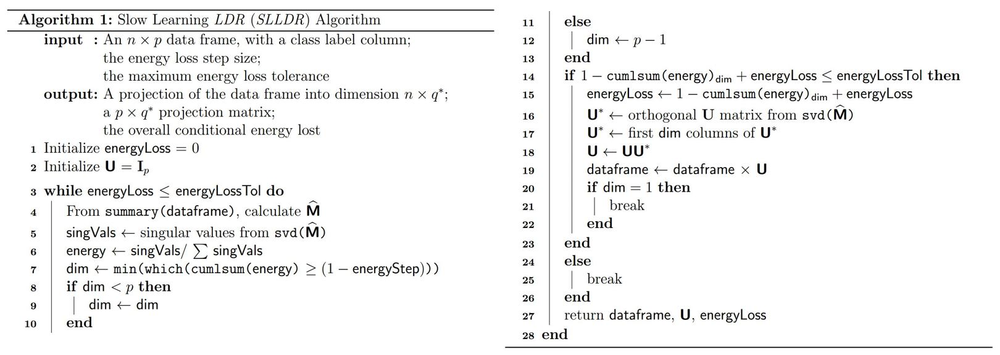

  
```{r setup, include=FALSE}
knitr::opts_chunk$set(echo = FALSE)
```

## Overiew of Topics

- Introduction of the Problem
- Four HLDR Techniques
- Two Dimension Reduction Methods
- Simulation Study
- Real Data Case
- Conclusion
- Future work
- References

<div class="notes">
  Smile! :) You got this!
  </div>
  
# Introduction
  
## Introduction
  
- We want to classify observations from different elliptical distributions.
- Real examples are often poorly posed ($n_i < p ^ 2 / 2$), thus precision matrix estimates are unstable.
- We introduce a competetor to PCA which uses the bias-variance tradeoff to stabilize these etimates.
- Employ dimension reduction to break the *curse of dimensionality* via iterated application of the singular value decomposition.

# Four HLDR Techniques

## Four HLDR Techniques

 - SY from @ounpraseuth_linear_2015
 - Sliced Inverse Regression (SIR) from @li_sliced_1991
 - LD from @loog_linear_2004
 - Sliced Average Variance Estimation (SAVE) from @cook_sliced_1991
 
## Notation
Consider a data matrix $\textbf{X}$ containing $n$ observations from $K$ distinct $p$-dimensional multivariate normal distributions, with class means $\boldsymbol\mu_k$ and class covariances $\boldsymbol\Sigma_k$, for $k \in 1, \ldots, K$. Furthermore, define

 - $\bar{\textbf{x}}_k$ is the sample mean vector for the $k^{th}$ class
 - $\alpha_k$ is the *a priori* probability of class membership for the $k^{th}$ class
 - $\bar{\textbf{x}} := \sum^K_{k = 1}\alpha_k\bar{\textbf{x}}_k$ is the grand mean
 - $\textbf{S}_W := \sum_{k = 1}^K\alpha_k\textbf{S}_k$ is the sample within-class covariance
 - $\textbf{S}_B := \sum^K_{k = 1}\left( \bar{\textbf{x}}_k - \bar{\textbf{x}} \right) \left( \bar{\textbf{x}}_k - \bar{\textbf{x}} \right)^T$ is the sample between-class covariance
 - $\widehat{\boldsymbol\Gamma} := \textbf{S}_B + \textbf{S}_W$ is the estimated marginal covariance of the data matrix
 
## A Dimension Reduction Result
*Theorem 1:*

Suppose we have $K$ multivariate normal populations each with mean $\boldsymbol\mu_k$, covariance matrix $\boldsymbol\Sigma_k \in \mathbb{R}^>_{p}$, and \textit{a priori} class membership $\alpha_k$, where $k = 1,...,K$.  Also, let 
\[
\textbf{M} := \left[\boldsymbol\Sigma^{-1}_2 \boldsymbol\mu_2 - \boldsymbol\Sigma^{-1}_1 \boldsymbol\mu_1 |...| \boldsymbol\Sigma^{-1}_K \boldsymbol\mu_K - \boldsymbol\Sigma^{-1}_1 \boldsymbol\mu_1 | \boldsymbol\Sigma_2 - \boldsymbol\Sigma_1 |...| \boldsymbol\Sigma_K - \boldsymbol\Sigma_1\right],
\]
where rank$(\textbf{M}) = q < p$, and let $\textbf{M} = \textbf{FG}$ be a full-rank decomposition of $\textbf{M}$, where $\textbf{F} \in \mathbb{R}_{p \times q}$.  Then, for an unlabeled observation vector $\textbf{x} \in \mathbb{R}_{p \times 1}$, $d_k(\textbf{x}) = d_k\left( \textbf{F}^+ \textbf{x} \right)$, where $d_k(\textbf{x})$ is the quadtratic discriminant function for the $k^{th}$ class and $k = 1,...,K$.

*Proof:* See @ounpraseuth_linear_2015.
 

## Two Simpler Methods
### SY
The data summary matrix for the *SY LDR* method of Ounpraseuth et al (2016) is
\[
\textbf{M} := \left[ \textbf{S}^{-1}_2 \bar{\textbf{x}}_2 - \textbf{S}^{-1}_1 \bar{\textbf{x}}_1, \ldots, \textbf{S}^{-1}_K \bar{\textbf{x}}_K - \textbf{S}^{-1}_1 \bar{\textbf{x}}_1, \textbf{S}_2 - \textbf{S}_1, \ldots, \textbf{S}_K - \textbf{S}_1 \right].
\]

### SIR
The data summary matrix for the *SIR LDR* method of Li (1991) is
\[
\textbf{M} := \widehat{\boldsymbol\Gamma}^{-1/2}\textbf{S}_B\widehat{\boldsymbol\Gamma}^{-1/2}.
\]

## Loog and Duin (2004)
The data summary matrix for the *LD LDR* method is
\[
\textbf{M} := \sum^{K - 1}_{i = 1} \sum^K_{j = i + 1} \alpha_i \alpha_j  \textbf{S}^{-1}_W \textbf{S}^{1/2}_W \left[ \tilde{\textbf{S}}^*_{ij} \right]  \textbf{S}^{1/2}_W,
\]
where
\[
\begin{aligned}
\tilde{\textbf{S}}^*_{ij} &:= \left( \textbf{S}^*_{(i,j)} \right)^{-\frac{1}{2}} \textbf{S}^{-1/2}_W \left( \bar{\textbf{x}}_i -  \bar{\textbf{x}}_j \right) \left( \bar{\textbf{x}}_i - \bar{\textbf{x}}_j \right)^T  \textbf{S}^{-1/2}_W \left( \textbf{S}^*_{(i,j)} \right)^{-\frac{1}{2}} \\
&\qquad + 
\frac{1}{\pi_i \pi_j} \left[ \log\left( \textbf{S}^*_{(i,j)} \right) - \pi_i \log\left( \textbf{S}^*_{(i,i)} \right) - \pi_j  \log\left( \textbf{S}^*_{(j,j)} \right) \right]
\end{aligned}
\]
and $\textbf{S}^*_{(i,j)} = \textbf{S}^{-1/2}_W \left( \pi_i\textbf{S}_i + \pi_j\textbf{S}_j \right) \textbf{S}^{-1/2}_W$.

## Sliced Average Variance Estimation (1991)
Using the notation modification of @velilla_method_2008 to Cook and Weisberg's original work, the data summary matrix for the *SAVE LDR* method is
\[
\textbf{M} := \left( \widehat{\boldsymbol\Gamma}^{-1/2} \textbf{S}_B \widehat{\boldsymbol\Gamma}^{-1/2} \right)^2 +  \widehat{\boldsymbol\Gamma}^{-1/2} \textbf{S}_{\widehat{\boldsymbol\Gamma}} \widehat{\boldsymbol\Gamma}^{-1/2},
\]
where
\[
\textbf{S}_{\widehat{\boldsymbol\Gamma}} := \frac{1}{K}\sum_{k = 1}^{K} \left( \textbf{S}_k - \textbf{S}_W \right) \widehat{\boldsymbol\Gamma}^{-1} \left( \textbf{S}_k - \textbf{S}_W \right).
\]


# Current vs. Slow Learning \emph{LDR} Algorithms

## PCA

The Principal Components Analysis (*PCA*) Algorithm for dimension reduction (using the Singular Value Decomposition of @eckart_approximation_1936) is as follows:

1.  Whiten the $n \times p$ data matrix $\textbf{X}$.
2.  Construct the appropriate $\textbf{M}$.
3.  Calculate the *SVD* of $\textbf{M} = \textbf{UDV}^T$.
4.  Choose a target dimension $q$ such that the largest $q$ singular values of $\textbf{M}$ account for at least $(1 - \alpha)$\% of the sum of all singular values (energy) of $\textbf{M}$.
5.  Select the first $q$ singular vectors of $\textbf{U}$ to be the $p \times q$ projection matrix.
6.  Multiply the $n \times p$ data matrix by the $p \times q$ projection matrix to linearly reduce the data from $p$ to $q$ dimensions, while preserving $(1 - \alpha)$\% of the energy of the data matrix.


  
## Slow Learning

The Slow Learning Linear Dimension Reduction (*SLLDR*) Algorithm for dimension reduction is as follows:

1.  Whiten the $n \times p$ data matrix $\textbf{X}$.
2.  Construct the appropriate $\textbf{M}$.
3.  Take the Singular Value Decomposition of $\textbf{M} = \textbf{UDV}^T$.
4.  Choose a target dimension $q_i$ such that the largest $q_i$ singular values of $\textbf{M}$ account for at least $(1 - \alpha / \text{steps})$\% of the energy of $\textbf{M}$.
5.  Select the first $q_i$ singular vectors of $\textbf{U}$ to be the $p \times q_i$ projection matrix.
6.  Multiply the $n \times p$ data matrix by the $p \times q_i$ projection matrix to linearlly reduce the data from $p$ to $q_i$ dimensions.
7.  Repeat Steps 2 -- 6.

## The Algorithm
```{r, out.width = "1000px"}

```

The difference of note between PCA and Slow Learning: the Slow Learning takes a few smaller "jumps" in dimension reduction rather than one large jump.

## A Projection Matrix Result
*Theorem 2:*

Suppose we have a sequence of subspace projection matrices $\textbf{U}_{p \times q_1}^{(1)}, \ldots, \textbf{U}_{q_{i - 1} \times q_i}^{(i)}$. Then the composition of the $i$ linear mappings can be represented by the chain of projection matrix multiplication
\[
\textbf{U}^*_{p \times q_i} = \textbf{U}_{p \times q_1}^{(1)} \times \ldots \times \textbf{U}_{q_{i - 1} \times q_i}^{(i)}.
\]

## A Projection Matrix Result
*Proof:*

Let $\textbf{X} \in \mathbb{R}_{n \times p}$ be an arbitrary matrix signifying a data frame of $n$ observations in $p$ dimensions. Let $\textbf{M}^{(1)} = \textbf{U}^{(1)}\textbf{DV}^T$ be the *SVD* of an $\textbf{M}$ matrix of $\textbf{X}$. Then by Theorem 1, the linear projection preserving *essentially* all the classification information of $\textbf{X}$ is the first $q_1$ columns of the matrix $\textbf{U}^{(1)}$. Now let $\textbf{M}^{(2)} = \textbf{U}^{(2)}\textbf{DV}^T$ be the *SVD* of the $\textbf{M}$ matrix of $\textbf{X}^{(1)}_{n \times q_1} = \textbf{X}\textbf{U}^{(1)}_{p \times q_1}$. Similarly,
$$
\begin{aligned}
\textbf{X}^{(2)}_{n \times q_2} &= \textbf{X} \times \textbf{U}^{(1)}_{p \times q_1} \times \textbf{U}^{(2)}_{q_1 \times q_2} \\
&\vdots \\
\Longrightarrow\qquad \textbf{X}^{(i)}_{n \times q_i} &= \textbf{X} \times \textbf{U}^{(1)}_{p \times q_1} \times \textbf{U}^{(2)}_{q_1 \times q_2} \times \ldots \times \textbf{U}_{q_{i - 1} \times q_i}^{(i)} \\
&= \textbf{X} \times \textbf{U}^*_{p \times q_i}.
\end{aligned}
$$


# Simulation Study

## Simulation Setup

<ol>
<li>For each class, generate 5,000 observations from the designated multivariate normal distribution.</li>
<li>Partition the 5,000 observations from each class into a training and testing data set 
<ol type = "i">
<li>To synthesize poorly-posed scenarios, take $n = 15$ training observations per class.</li>
<li> Hold 4,985 observations aside for testing.</li>
</ol>
</li>
</ol>
    
## Simulation Setup
<ol start = "3">
<li>For each method:
<ol type = "i">
<li>Project the training and test data down from $p$ to $r$ dimensions, for $r\in 1,\ldots, p - 1$.</li>
<li>Construct the classifier.</li>
<li>Classify the test observations.</li>
<li>Record the conditional error rate.</li>
</ol>
</li>
<li>Repeat Steps 1--3 5,000 times.</li>
<li>Increase $n$ from 15 to 30 then 60, and repeat Steps 1--4</li>
</ol>

See supplementary material for mean and covariance specifications.

## Synthetic Data Results
```{r}
knitr::include_graphics("C:/Users/gabriel_odom/Box Sync/Research/Slow Learning/Config13_FacetWrap16012017.png")
```

## Ionosphere Results from @sigillito_classification_1989
```{r}
knitr::include_graphics("C:/Users/gabriel_odom/Box Sync/Research/Slow Learning/Ion_FacetWrap16012017.png")
```

## Drive Diagnosis Results from @paschke_sensorlose_2013
```{r}
knitr::include_graphics("C:/Users/gabriel_odom/Box Sync/Research/Slow Learning/DriverlessCar_FacetWrap16012017.png")
```

# Summary and References

## Summary

- Discussed four linear dimension reduction methods
- Presented and compared two decompostion algorithms
- Produced simulation results showing Slow Learning algorithm efficacy
- Applied our algorithm to two real-world classification exercises

Special thanks to @bache_uci_2013 for managing the UC-Irvine Machine Learning Repository -- a wealth of real machine learning data.

<style>
slides > slide { overflow: scroll; }
slides > slide:not(.nobackground):after {
  content: '';
}
</style>


## References 

